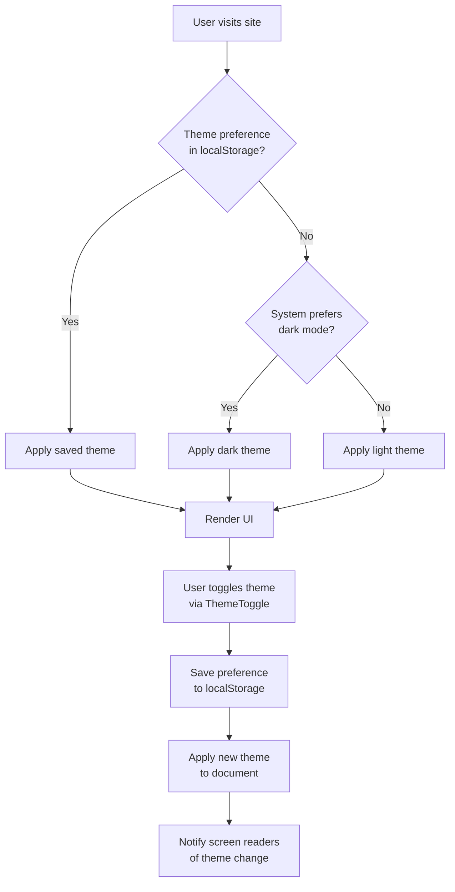

# Dark Mode Implementation Design Document

## 1. Overview

This document outlines the implementation of a dark mode toggle feature for the Chía Portal system. The project already has a comprehensive dark mode CSS system in place using CSS custom properties, but lacks a user interface element to switch between light and dark themes.

The implementation will include:
- A theme toggle component in the header
- Theme persistence using localStorage
- System preference detection
- Accessibility considerations for screen readers
- Proper visual feedback during theme transitions

## 2. Architecture

### 2.1 Current State Analysis

The project already has:
- CSS custom properties for both light and dark themes defined in `globals.css`
- Dark mode color schemes for all service card variants
- Dark mode support in core components (Card, Button)
- Existing dark mode tests in the test suite
- ARIA attributes and accessibility considerations

### 2.2 Proposed Architecture

```
┌─────────────────────────────────────────────────────────────────┐
│                    Component Hierarchy                          │
├─────────────────────────────────────────────────────────────────┤
│  RootLayout                                                     │
│  ├── ThemeProvider (New)                                        │
│  │   ├── Header (Modified)                                      │
│  │   │   └── ThemeToggle (New)                                  │
│  │   └── ... other components                                   │
│  └── ...                                                        │
└─────────────────────────────────────────────────────────────────┘
```

### 2.3 Theme Management Flow



## 3. Component Design

### 3.1 ThemeToggle Component

#### Props Interface
```typescript
interface ThemeToggleProps {
  className?: string;
  size?: 'sm' | 'md' | 'lg';
}
```

#### Key Features
- Accessible button with proper ARIA attributes
- Icon that changes based on current theme (sun/moon)
- Smooth transition animations
- Keyboard navigation support
- Screen reader announcements

#### Implementation Details
- Uses localStorage to persist user preference
- Respects system preference when no user preference is set
- Implements proper focus management
- Uses CSS transitions for smooth theme switching

### 3.2 ThemeProvider Component

#### Context Interface
```typescript
interface ThemeContextType {
  theme: 'light' | 'dark' | 'system';
  setTheme: (theme: 'light' | 'dark' | 'system') => void;
  resolvedTheme: 'light' | 'dark';
}
```

#### Responsibilities
- Manage current theme state
- Handle theme persistence
- Apply theme to document root
- Provide theme information to child components

## 4. Integration Points

### 4.1 Header Integration
The ThemeToggle component will be integrated into the Header component's right section, alongside the user profile and mobile menu button.

### 4.2 Root Layout Integration
A ThemeProvider will wrap the application in the root layout to provide theme context to all components.

### 4.3 CSS Integration
The existing CSS custom properties system will be leveraged with no changes needed to the core styling.

## 5. User Interface Design

### 5.1 Visual Design

#### Light Theme
- Icon: Moon (to indicate switching to dark mode)
- Background: Match header background
- Hover state: Subtle background change

#### Dark Theme
- Icon: Sun (to indicate switching to light mode)
- Background: Match header background
- Hover state: Subtle background change

### 5.2 Responsive Design
- Desktop: Integrated in header navigation
- Mobile: Integrated in header navigation (same position)
- Touch targets: Minimum 44px as per accessibility guidelines

### 5.3 Animation
- Smooth transition when toggling themes (200-300ms)
- Icon transition animation
- Theme change should not cause layout shifts

## 6. Technical Implementation

### 6.1 Theme Detection Logic

```javascript
// Pseudocode for theme detection
function detectTheme() {
  // Check localStorage first
  const savedTheme = localStorage.getItem('theme');
  if (savedTheme) return savedTheme;
  
  // Fall back to system preference
  if (window.matchMedia('(prefers-color-scheme: dark)').matches) {
    return 'dark';
  }
  
  return 'light';
}
```

### 6.2 Theme Application Logic

```javascript
// Pseudocode for theme application
function applyTheme(theme) {
  const root = document.documentElement;
  
  if (theme === 'dark') {
    root.classList.add('dark');
    root.setAttribute('data-theme', 'dark');
  } else {
    root.classList.remove('dark');
    root.removeAttribute('data-theme');
  }
  
  // Save to localStorage
  localStorage.setItem('theme', theme);
}
```

### 6.3 Component Integration

#### Header Component Modification
```tsx
// Add to Header component's right section
<div className="flex items-center space-x-2 sm:space-x-3">
  {/* Theme Toggle */}
  <ThemeToggle />
  
  {/* Existing user section and mobile menu button */}
  {/* ... */}
</div>
```

## 7. Accessibility Considerations

### 7.1 Screen Reader Support
- Theme changes will be announced using `aria-live` regions
- Toggle button will have descriptive labels that change with theme
- Proper focus management during theme transitions

### 7.2 Keyboard Navigation
- Theme toggle will be focusable with Tab key
- Theme can be toggled with Enter or Space keys
- Focus indicator will be visible in both themes

### 7.3 Reduced Motion Support
- Theme transitions will respect `prefers-reduced-motion` media query
- Animations will be disabled when reduced motion is preferred

## 8. Testing Strategy

### 8.1 Unit Tests
- ThemeProvider functionality
- ThemeToggle component rendering
- Theme persistence in localStorage
- System preference detection

### 8.2 Integration Tests
- Theme switching behavior
- Component appearance in both themes
- Accessibility attributes

### 8.3 Visual Regression Tests
- Theme appearance consistency across browsers
- No layout shifts during theme transitions
- Component styling in both themes

### 8.4 Performance Tests
- Theme switching speed (< 100ms)
- No blocking operations during theme application

## 9. Implementation Steps

### Phase 1: Core Infrastructure
1. Create ThemeContext and ThemeProvider
2. Implement theme detection and application logic
3. Add theme persistence to localStorage

### Phase 2: UI Component
1. Create ThemeToggle component
2. Implement icon switching based on theme
3. Add accessibility attributes and screen reader support

### Phase 3: Integration
1. Integrate ThemeProvider in root layout
2. Add ThemeToggle to Header component
3. Test theme persistence across page reloads

### Phase 4: Testing and Refinement
1. Implement unit tests
2. Conduct accessibility testing
3. Perform visual regression testing
4. Optimize performance

## 10. Expected Outcomes

### 10.1 User Experience
- Seamless theme switching with visual feedback
- Theme preference persistence across sessions
- Automatic adaptation to system preferences
- Accessible interface for all users

### 10.2 Technical Benefits
- Leveraging existing CSS infrastructure
- Minimal impact on bundle size
- No layout shifts during theme transitions
- Proper separation of concerns

### 10.3 Performance
- Theme switching under 100ms
- No blocking operations
- Efficient localStorage usage
- Minimal re-renders