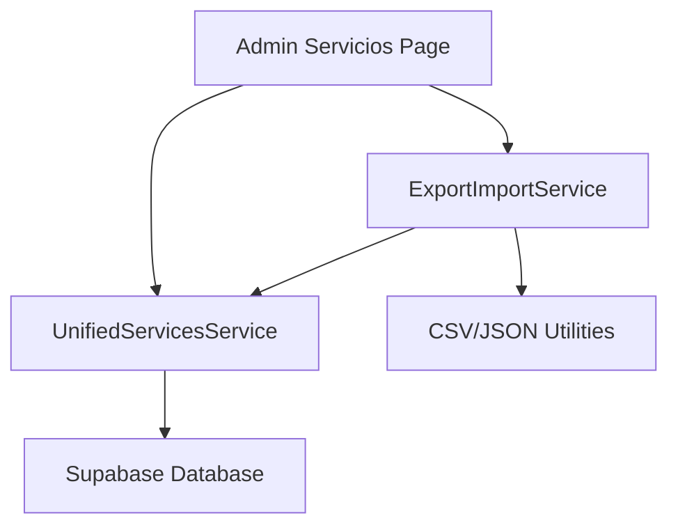
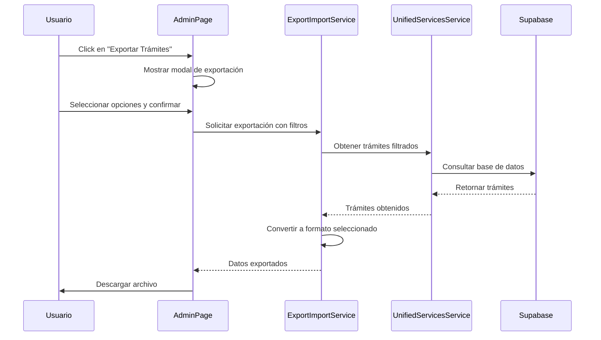
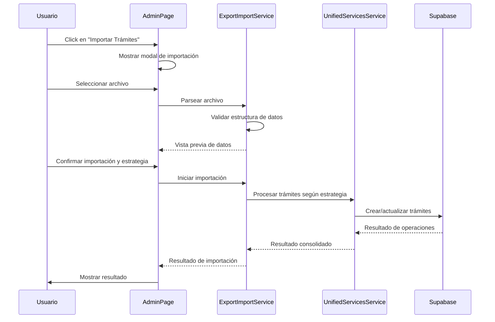

# Diseño de Funcionalidad: Exportación e Importación de Trámites y OPAs

## 1. Descripción General

Esta funcionalidad permitirá a los administradores exportar e importar trámites y OPAs (Órdenes de Pago) desde la página de gestión de servicios en `/admin/servicios`. La implementación incluirá tanto la exportación de datos en formato CSV/JSON como la importación de datos desde archivos del mismo formato, manteniendo la integridad de todos los campos de trámites y OPAs.

## 2. Arquitectura del Sistema

### 2.1 Componentes Principales



### 2.2 Flujo de Datos

1. El administrador accede a `/admin/servicios`
2. Selecciona la opción de exportar/importar trámites
3. Para exportación: El sistema recupera los datos de trámites y los convierte al formato seleccionado
4. Para importación: El sistema procesa el archivo y crea/actualiza trámites en la base de datos

## 3. Interfaz de Usuario

### 3.1 Ubicación de la Funcionalidad

La funcionalidad se integrará en la página de gestión de servicios (`/admin/servicios`) como acciones adicionales en la barra de herramientas.

### 3.2 Componentes de UI

#### Botones de Exportación/Importación
- **Botón de Exportar**: "📥 Exportar Servicios"
- **Botón de Importar**: "📤 Importar Servicios"

*Nota: Los servicios incluyen tanto trámites como OPAs (Órdenes de Pago)*

#### Modal de Exportación
- Selector de formato (CSV/JSON)
- Opciones de exportación:
  - Todos los trámites visibles (filtrados)
  - Todos los trámites del sistema
- Vista previa de datos a exportar
- Botón de descarga

#### Modal de Importación
- Área de arrastrar y soltar para archivos
- Selector de formato (CSV/JSON)
- Vista previa de datos a importar
- Opciones de manejo de conflictos:
  - Actualizar trámites existentes
  - Omitir trámites existentes
  - Crear nuevos trámites
- Botón de importación

## 4. Modelo de Datos

### 4.1 Estructura de Trámite

Los trámites contienen los siguientes campos principales según la definición en `src/types/index.ts`:

| Campo | Tipo | Requerido | Descripción |
|-------|------|-----------|-------------|
| id | string | Sí | Identificador único |
| codigo_unico | string | Sí | Código único del trámite |
| nombre | string | Sí | Nombre del trámite |
| formulario | string | No | Formulario asociado |
| tiempo_respuesta | string | No | Tiempo estimado de respuesta |
| tiene_pago | boolean | Sí | Indica si requiere pago |
| visualizacion_suit | string | No | URL para portal SUIT |
| visualizacion_gov | string | No | URL para portal GOV.CO |
| subdependencia_id | string | Sí | ID de subdependencia |
| activo | boolean | Sí | Estado del trámite |
| requisitos | string[] | No | Lista de requisitos |
| instructivo | string[] | No | Instrucciones paso a paso |
| modalidad | 'virtual' \| 'presencial' \| 'mixto' | Sí | Modo de procesamiento |
| categoria | string | No | Categoría temática |
| observaciones | string | No | Observaciones adicionales |
| created_at | string | Sí | Fecha de creación |
| updated_at | string | Sí | Fecha de actualización |
| subdependencias | object | No | Información de la subdependencia relacionada |
| subdependencias.id | string | No | ID de la subdependencia |
| subdependencias.nombre | string | No | Nombre de la subdependencia |
| subdependencias.dependencias | object | No | Información de la dependencia |
| subdependencias.dependencias.id | string | No | ID de la dependencia |
| subdependencias.dependencias.nombre | string | No | Nombre de la dependencia |

### 4.2 Estructura de OPA (Orden de Pago)

Las OPAs contienen los siguientes campos principales según la definición en `src/types/index.ts`:

| Campo | Tipo | Requerido | Descripción |
|-------|------|-----------|-------------|
| id | string | Sí | Identificador único |
| codigo_opa | string | Sí | Código único de la OPA |
| nombre | string | Sí | Nombre de la OPA |
| descripcion | string | No | Descripción detallada |
| formulario | string | No | Formulario asociado |
| tiempo_respuesta | string | No | Tiempo estimado de respuesta |
| tiene_pago | boolean | Sí | Indica si requiere pago |
| visualizacion_suit | string | No | URL para portal SUIT |
| visualizacion_gov | string | No | URL para portal GOV.CO |
| subdependencia_id | string | Sí | ID de subdependencia |
| activo | boolean | Sí | Estado de la OPA |
| requisitos | string[] | No | Lista de requisitos |
| created_at | string | Sí | Fecha de creación |
| updated_at | string | Sí | Fecha de actualización |
| subdependencias | object | No | Información de la subdependencia relacionada |
| subdependencias.id | string | No | ID de la subdependencia |
| subdependencias.nombre | string | No | Nombre de la subdependencia |
| subdependencias.dependencias | object | No | Información de la dependencia |
| subdependencias.dependencias.id | string | No | ID de la dependencia |
| subdependencias.dependencias.nombre | string | No | Nombre de la dependencia |

## 5. Servicios Backend

### 5.1 Servicio de Exportación/Importación

Se creará un nuevo servicio `ExportImportService` con las siguientes funciones:

#### Funciones de Exportación
```typescript
// Exportar servicios (trámites y OPAs) a CSV
exportServicesToCSV(services: (Tramite | OPA)[]): string

// Exportar servicios (trámites y OPAs) a JSON
exportServicesToJSON(services: (Tramite | OPA)[]): string

// Obtener servicios para exportación
getServicesForExport(filters: UnifiedSearchFilters): Promise<(Tramite | OPA)[]>
```

#### Funciones de Importación
```typescript
// Parsear archivo CSV a servicios (trámites y OPAs)
parseCSVToServices(csvContent: string): (Tramite | OPA)[]

// Parsear archivo JSON a servicios (trámites y OPAs)
parseJSONToServices(jsonContent: string): (Tramite | OPA)[]

// Importar servicios a la base de datos
importServices(services: (Tramite | OPA)[], conflictStrategy: 'update' | 'skip' | 'create'): Promise<ImportResult>
```

### 5.2 Integración con Servicios Existentes

El servicio utilizará los servicios existentes:
- `unifiedServicesService` para operaciones CRUD de servicios (trámites y OPAs)
- `tramitesClientService` para operaciones específicas de trámites
- `opasClientService` para operaciones específicas de OPAs

## 6. Flujo de Trabajo

### 6.1 Exportación de Servicios (Trámites y OPAs)



### 6.2 Importación de Servicios (Trámites y OPAs)



## 7. Consideraciones Técnicas

### 7.1 Validación de Datos

- Validación de estructura de archivos CSV/JSON
- Validación de campos requeridos
- Validación de tipos de datos
- Validación de unicidad de códigos
- Validación de formato de códigos únicos
- Validación de existencia de subdependencias
- Validación de valores permitidos para modalidad (solo para trámites)
- Validación de formato de fechas
- Validación diferenciada para trámites y OPAs según su estructura

### 7.2 Manejo de Errores

- Errores de formato de archivo
- Errores de validación de datos
- Errores de conexión a base de datos
- Errores de permisos
- Errores de procesamiento por lotes
- Errores de duplicados de códigos únicos
- Errores de integridad referencial (subdependencias inexistentes)

### 7.3 Seguridad

- Verificación de roles de usuario (solo administradores)
- Validación de datos de entrada
- Protección contra inyección de datos maliciosos

### 7.4 Rendimiento

- Procesamiento por lotes para importaciones grandes (lotes de 50 registros)
- Uso de promesas para operaciones asíncronas
- Manejo de memoria para archivos grandes
- Progreso incremental para operaciones largas
- Cancelación de operaciones en curso

## 8. Pruebas

### 8.1 Pruebas Unitarias

- Validación de funciones de exportación (trámites y OPAs)
- Validación de funciones de importación (trámites y OPAs)
- Pruebas de parseo de archivos CSV
- Pruebas de parseo de archivos JSON
- Pruebas de validación de datos
- Pruebas de manejo de errores
- Pruebas de procesamiento por lotes
- Pruebas de diferenciación entre trámites y OPAs

### 8.2 Pruebas de Integración

- Flujo completo de exportación (trámites y OPAs)
- Flujo completo de importación (trámites y OPAs)
- Manejo de conflictos
- Validación de datos en base de datos
- Pruebas de importación de archivos grandes
- Pruebas de recuperación de errores
- Pruebas de concurrencia
- Pruebas de integridad referencial para trámites y OPAs

### 8.3 Pruebas de UI

- Funcionalidad de botones
- Modal de exportación (trámites y OPAs)
- Modal de importación (trámites y OPAs)
- Manejo de errores en UI
- Arrastrar y soltar archivos
- Indicadores de progreso
- Respuesta a diferentes tamaños de pantalla
- Visualización correcta de datos de trámites y OPAs

## 9. Implementación

### 9.1 Archivos a Modificar

1. `src/app/admin/servicios/page.tsx` - Agregar acciones de exportación/importación
2. `src/services/exportImportService.ts` - Nuevo servicio para manejar la lógica de exportación e importación
3. `src/components/organisms/ExportModal.tsx` - Componente modal para exportación de servicios (trámites y OPAs)
4. `src/components/organisms/ImportModal.tsx` - Componente modal para importación de servicios (trámites y OPAs)
5. `src/hooks/useExportImport.ts` - Hook personalizado para la lógica compartida de exportación/importación
6. `src/utils/fileUtils.ts` - Utilidades para manejo de archivos (CSV/JSON parsing y generación)

### 9.2 Componentes Nuevos

1. `ExportModal` - Componente para exportación de trámites
   - Selector de formato (CSV/JSON)
   - Opciones de exportación (todos, filtrados)
   - Vista previa de datos
   - Botón de descarga

2. `ImportModal` - Componente para importación de trámites
   - Área de arrastrar y soltar archivos
   - Selector de estrategia de conflictos
   - Vista previa de datos a importar
   - Indicador de progreso
   - Resumen de resultados

### 9.3 Hooks Nuevos

1. `useExportImport` - Hook personalizado para lógica de exportación/importación
   - Funciones para exportar trámites
   - Funciones para importar trámites
   - Estado de carga y errores
   - Manejo de progreso para operaciones largas
   - Validación de datos importados

## 10. Consideraciones Adicionales

### 10.1 Compatibilidad

- Compatibilidad con formatos CSV y JSON
- Compatibilidad con diferentes tamaños de archivos
- Compatibilidad con navegadores modernos

### 10.2 Escalabilidad

- Procesamiento eficiente de grandes volúmenes de datos
- Uso eficiente de memoria
- Manejo de errores robusto

### 10.3 Mantenibilidad

- Código modular y bien documentado
- Separación clara de responsabilidades
- Facilidad para agregar nuevos formatos en el futuro