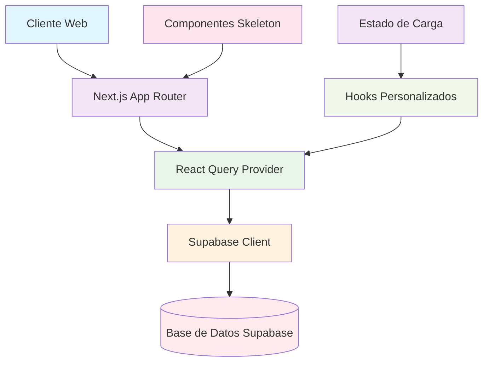

# Análisis de Problemas de Carga de Páginas y Estados Skeleton

## 1. Resumen Ejecutivo

Este documento analiza el problema de las páginas que inicialmente cargan correctamente pero después quedan atrapadas en estados de carga skeleton, requiriendo un refresco manual (F5) para visualizar los datos correctamente. El análisis identifica múltiples factores contribuyentes en la arquitectura de datos y configuración de React Query.

## 2. Arquitectura del Sistema de Carga y Estados Skeleton

### 2.1 Componentes Principales



### 2.2 Flujo de Carga de Datos

1. **Inicio de carga**: Componente montado solicita datos
2. **Estado skeleton**: Componentes skeleton mostrados mientras se cargan datos
3. **Petición API**: React Query ejecuta petición a Supabase
4. **Respuesta**: Datos retornados o error capturado
5. **Renderizado**: Datos mostrados o mensaje de error

### 2.3 Componentes de Estado Skeleton

El sistema utiliza varios componentes skeleton para mejorar la percepción de rendimiento:

- `Skeleton`: Componente base para elementos de carga
- `SkeletonLoader`: Componente avanzado con múltiples variantes
- `TableSkeleton`: Para tablas de datos
- `TramiteCardSkeleton`: Para tarjetas de trámites
- `UnifiedServiceCardSkeleton`: Para tarjetas de servicios unificados

## 3. Configuración de React Query

### 3.1 Configuración Global del Cliente

```typescript
const queryClient = new QueryClient({
  defaultOptions: {
    queries: {
      staleTime: 5 * 60 * 1000,        // 5 minutos
      gcTime: 10 * 60 * 1000,          // 10 minutos
      retry: 3,                        // 3 reintentos
      retryDelay: (attemptIndex) => 
        Math.min(1000 * 2 ** attemptIndex, 30000),
      refetchOnWindowFocus: true,      // Refetch al enfocar ventana
      refetchOnReconnect: false,       // No refetch al reconectar
      refetchInterval: false,          // Sin refetch automático
    },
    mutations: {
      retry: 1,                      // 1 reintento para mutaciones
      retryDelay: 1000,              // 1 segundo entre reintentos
    },
  },
})
```

### 3.2 Configuración por Hook

Diferentes hooks tienen configuraciones específicas:

- `useSystemMetricsQuery`: 
  - `staleTime`: 2 minutos
  - `gcTime`: 10 minutos
  - `refetchInterval`: 5 minutos
  - `retry`: 3

- `useUnifiedSearchQuery`:
  - `staleTime`: 2 minutos
  - `gcTime`: 5 minutos
  - `retry`: 1
  - `refetchOnWindowFocus`: false

## 4. Configuración del Cliente Supabase

### 4.1 Singleton Pattern y Reutilización de Conexiones

```typescript
// Singleton instance for connection pooling
let supabaseInstance: SupabaseClient | null = null

function getSupabaseClient(): SupabaseClient {
  if (!supabaseInstance) {
    console.log('🔄 [DBA] Creating new connection instance')
    supabaseInstance = createOptimizedSupabaseClient()
  } else {
    console.log('♻️ [DBA] Reusing existing connection')
  }
  return supabaseInstance
}
```

### 4.2 Estrategias de Cliente

- **Cliente de navegador**: Utiliza `createBrowserClient` para manejo consistente de cookies
- **Cliente de servidor**: Fallback con `createClient` para operaciones del lado del servidor

## 5. Análisis de Problemas Potenciales

### 5.1 Problemas de Configuración de React Query

1. **staleTime demasiado largo**: 
   - Configurado en 5 minutos globalmente
   - Puede causar que datos "stale" se muestren sin refetch

2. **refetchOnWindowFocus**: 
   - Activado globalmente
   - Puede causar múltiples refetch innecesarios

3. **retry y retryDelay**: 
   - Configuración agresiva puede causar tiempos de espera largos
   - Sin límite máximo claro en exponencial backoff

### 5.2 Problemas de Conexión con Supabase

1. **Reutilización de conexiones**:
   - Singleton pattern puede causar problemas si la conexión se corrompe
   - No hay mecanismo de reinicio de conexión

2. **Manejo de errores de red**:
   - No hay detección específica de errores de red
   - No hay políticas de reconexión definidas

### 5.3 Problemas de Componentes Skeleton

1. **Transiciones de estado**:
   - Posible desincronización entre estado de carga y renderizado
   - No hay mecanismo de timeout para estados skeleton

2. **Hooks de carga personalizados**:
   - `useLoadingStates` tiene estados progresivos que pueden quedar atascados
   - No hay mecanismo de recuperación de estados atascados

## 6. Diagnóstico de Problemas

### 6.1 Escenarios de Falla Identificados

1. **Conexión perdida temporalmente**:
   ```
   Usuario carga página → Conexión se pierde → React Query intenta reintentar → 
   Límite de reintentos alcanzado → Estado skeleton persiste
   ```

2. **Datos corruptos en cache**:
   ```
   Datos en cache se corrompen → React Query no puede refrescar → 
   Componentes skeleton mostrados indefinidamente
   ```

3. **Desincronización de estado**:
   ```
   Estado de carga no se actualiza correctamente → 
   Componentes skeleton no se ocultan → 
   Datos cargados pero no mostrados
   ```

### 6.2 Factores Contribuyentes

1. **Configuración de timeouts**:
   - No hay timeouts definidos para peticiones
   - No hay mecanismos de fallback cuando las peticiones tardan demasiado

2. **Manejo de errores**:
   - Errores no se manejan de forma consistente
   - No hay mecanismos de recuperación automática

3. **Cache agresivo**:
   - `gcTime` de 10 minutos puede mantener datos inválidos
   - Sin mecanismos de invalidación proactiva

## 7. Recomendaciones

### 7.1 Ajustes de Configuración

1. **Reducir staleTime**:
   ```typescript
   // Cambiar de 5 minutos a 2 minutos
   staleTime: 2 * 60 * 1000
   ```

2. **Ajustar retry y retryDelay**:
   ```typescript
   retry: 2,
   retryDelay: (attemptIndex) => 
     Math.min(500 * 2 ** attemptIndex, 10000)
   ```

3. **Agregar timeouts**:
   ```typescript
   // Agregar timeout global para peticiones
   defaultOptions: {
     queries: {
       // ... otras opciones
       meta: {
         timeout: 10000 // 10 segundos
       }
     }
   }
   ```

### 7.2 Mejoras en Manejo de Conexiones

1. **Agregar mecanismo de health check**:
   ```typescript
   // Función para verificar estado de conexión
   async function checkConnectionHealth() {
     try {
       const { data, error } = await supabase
         .from('dependencias')
         .select('id')
         .limit(1)
       
       return !error
     } catch {
       return false
     }
   }
   ```

2. **Implementar reinicio de conexión**:
   ```typescript
   // Función para reiniciar cliente Supabase
   function resetSupabaseClient() {
     supabaseInstance = null
     getSupabaseClient() // Crear nueva instancia
   }
   ```

### 7.3 Mejoras en Componentes Skeleton

1. **Agregar timeout a estados skeleton**:
   ```typescript
   // En hooks de carga personalizados
   useEffect(() => {
     const timeout = setTimeout(() => {
       if (loading) {
         setError('Tiempo de espera agotado')
       }
     }, 15000) // 15 segundos
     
     return () => clearTimeout(timeout)
   }, [loading])
   ```

2. **Agregar mecanismo de recuperación**:
   ```typescript
   // En componentes que usan skeleton
   const handleRetry = () => {
     // Invalidar cache y refetch
     queryClient.invalidateQueries()
   }
   ```

### 7.4 Monitoreo y Logging

1. **Agregar logging de errores detallado**:
   ```typescript
   // En hooks de datos
   onError: (error) => {
     console.error('Query error:', {
       queryKey,
       error: error.message,
       timestamp: new Date().toISOString()
     })
   }
   ```

2. **Implementar monitoreo de performance**:
   ```typescript
   // Medir tiempos de carga
   const startTime = Date.now()
   // ... después de cargar
   const loadTime = Date.now() - startTime
   ```

## 8. Plan de Implementación

### 8.1 Fase 1: Diagnóstico y Logging (1-2 días)

1. Implementar logging detallado de errores de red
2. Agregar monitoreo de tiempos de carga
3. Crear herramientas de diagnóstico

### 8.2 Fase 2: Ajustes de Configuración (2-3 días)

1. Reducir staleTime y gcTime
2. Ajustar políticas de retry
3. Agregar timeouts

### 8.3 Fase 3: Mejoras en Manejo de Conexiones (3-4 días)

1. Implementar health checks
2. Agregar mecanismos de reinicio de conexión
3. Mejorar manejo de errores de red

### 8.4 Fase 4: Mejoras en Componentes UI (2-3 días)

1. Agregar timeouts a estados skeleton
2. Implementar mecanismos de recuperación
3. Mejorar feedback al usuario

## 9. Conclusión

El problema de las páginas que quedan atrapadas en estados skeleton es multifacético, relacionado con la configuración de React Query, manejo de conexiones Supabase y falta de mecanismos de recuperación. La solución requiere un enfoque integral que aborde tanto la configuración del sistema de caching como la implementación de mecanismos de recuperación y monitoreo.    style E fill:#ffebee
    style F fill:#f1f8e9
    style G fill:#fce4ec
    style H fill:#f3e5f5
```

### 2.2 Flujo de Carga de Datos

1. **Inicio de carga**: Componente montado solicita datos
2. **Estado skeleton**: Componentes skeleton mostrados mientras se cargan datos
3. **Petición API**: React Query ejecuta petición a Supabase
4. **Respuesta**: Datos retornados o error capturado
5. **Renderizado**: Datos mostrados o mensaje de error

### 2.3 Componentes de Estado Skeleton

El sistema utiliza varios componentes skeleton para mejorar la percepción de rendimiento:

- `Skeleton`: Componente base para elementos de carga
- `SkeletonLoader`: Componente avanzado con múltiples variantes
- `TableSkeleton`: Para tablas de datos
- `TramiteCardSkeleton`: Para tarjetas de trámites
- `UnifiedServiceCardSkeleton`: Para tarjetas de servicios unificados

## 3. Configuración de React Query

### 3.1 Configuración Global del Cliente

```typescript
const queryClient = new QueryClient({
  defaultOptions: {
    queries: {
      staleTime: 5 * 60 * 1000,        // 5 minutos
      gcTime: 10 * 60 * 1000,          // 10 minutos
      retry: 3,                        // 3 reintentos
      retryDelay: (attemptIndex) => 
        Math.min(1000 * 2 ** attemptIndex, 30000),
      refetchOnWindowFocus: true,      // Refetch al enfocar ventana
      refetchOnReconnect: false,       // No refetch al reconectar
      refetchInterval: false,          // Sin refetch automático
    },
    mutations: {
      retry: 1,                      // 1 reintento para mutaciones
      retryDelay: 1000,              // 1 segundo entre reintentos
    },
  },
})
```

### 3.2 Configuración por Hook

Diferentes hooks tienen configuraciones específicas:

- `useSystemMetricsQuery`: 
  - `staleTime`: 2 minutos
  - `gcTime`: 10 minutos
  - `refetchInterval`: 5 minutos
  - `retry`: 3

- `useUnifiedSearchQuery`:
  - `staleTime`: 2 minutos
  - `gcTime`: 5 minutos
  - `retry`: 1
  - `refetchOnWindowFocus`: false

## 4. Configuración del Cliente Supabase

### 4.1 Singleton Pattern y Reutilización de Conexiones

```typescript
// Singleton instance for connection pooling
let supabaseInstance: SupabaseClient | null = null

function getSupabaseClient(): SupabaseClient {
  if (!supabaseInstance) {
    console.log('🔄 [DBA] Creating new connection instance')
    supabaseInstance = createOptimizedSupabaseClient()
  } else {
    console.log('♻️ [DBA] Reusing existing connection')
  }
  return supabaseInstance
}
```

### 4.2 Estrategias de Cliente

- **Cliente de navegador**: Utiliza `createBrowserClient` para manejo consistente de cookies
- **Cliente de servidor**: Fallback con `createClient` para operaciones del lado del servidor

## 5. Análisis de Problemas Potenciales

### 5.1 Problemas de Configuración de React Query

1. **staleTime demasiado largo**: 
   - Configurado en 5 minutos globalmente
   - Puede causar que datos "stale" se muestren sin refetch

2. **refetchOnWindowFocus**: 
   - Activado globalmente
   - Puede causar múltiples refetch innecesarios

3. **retry y retryDelay**: 
   - Configuración agresiva puede causar tiempos de espera largos
   - Sin límite máximo claro en exponencial backoff

### 5.2 Problemas de Conexión con Supabase

1. **Reutilización de conexiones**:
   - Singleton pattern puede causar problemas si la conexión se corrompe
   - No hay mecanismo de reinicio de conexión

2. **Manejo de errores de red**:
   - No hay detección específica de errores de red
   - No hay políticas de reconexión definidas

### 5.3 Problemas de Componentes Skeleton

1. **Transiciones de estado**:
   - Posible desincronización entre estado de carga y renderizado
   - No hay mecanismo de timeout para estados skeleton

2. **Hooks de carga personalizados**:
   - `useLoadingStates` tiene estados progresivos que pueden quedar atascados
   - No hay mecanismo de recuperación de estados atascados

## 6. Diagnóstico de Problemas

### 6.1 Escenarios de Falla Identificados

1. **Conexión perdida temporalmente**:
   ```
   Usuario carga página → Conexión se pierde → React Query intenta reintentar → 
   Límite de reintentos alcanzado → Estado skeleton persiste
   ```

2. **Datos corruptos en cache**:
   ```
   Datos en cache se corrompen → React Query no puede refrescar → 
   Componentes skeleton mostrados indefinidamente
   ```

3. **Desincronización de estado**:
   ```
   Estado de carga no se actualiza correctamente → 
   Componentes skeleton no se ocultan → 
   Datos cargados pero no mostrados
   ```

### 6.2 Factores Contribuyentes

1. **Configuración de timeouts**:
   - No hay timeouts definidos para peticiones
   - No hay mecanismos de fallback cuando las peticiones tardan demasiado

2. **Manejo de errores**:
   - Errores no se manejan de forma consistente
   - No hay mecanismos de recuperación automática

3. **Cache agresivo**:
   - `gcTime` de 10 minutos puede mantener datos inválidos
   - Sin mecanismos de invalidación proactiva

## 7. Recomendaciones

### 7.1 Ajustes de Configuración

1. **Reducir staleTime**:
   ```typescript
   // Cambiar de 5 minutos a 2 minutos
   staleTime: 2 * 60 * 1000
   ```

2. **Ajustar retry y retryDelay**:
   ```typescript
   retry: 2,
   retryDelay: (attemptIndex) => 
     Math.min(500 * 2 ** attemptIndex, 10000)
   ```

3. **Agregar timeouts**:
   ```typescript
   // Agregar timeout global para peticiones
   defaultOptions: {
     queries: {
       // ... otras opciones
       meta: {
         timeout: 10000 // 10 segundos
       }
     }
   }
   ```

### 7.2 Mejoras en Manejo de Conexiones

1. **Agregar mecanismo de health check**:
   ```typescript
   // Función para verificar estado de conexión
   async function checkConnectionHealth() {
     try {
       const { data, error } = await supabase
         .from('dependencias')
         .select('id')
         .limit(1)
       
       return !error
     } catch {
       return false
     }
   }
   ```

2. **Implementar reinicio de conexión**:
   ```typescript
   // Función para reiniciar cliente Supabase
   function resetSupabaseClient() {
     supabaseInstance = null
     getSupabaseClient() // Crear nueva instancia
   }
   ```

### 7.3 Mejoras en Componentes Skeleton

1. **Agregar timeout a estados skeleton**:
   ```typescript
   // En hooks de carga personalizados
   useEffect(() => {
     const timeout = setTimeout(() => {
       if (loading) {
         setError('Tiempo de espera agotado')
       }
     }, 15000) // 15 segundos
     
     return () => clearTimeout(timeout)
   }, [loading])
   ```

2. **Agregar mecanismo de recuperación**:
   ```typescript
   // En componentes que usan skeleton
   const handleRetry = () => {
     // Invalidar cache y refetch
     queryClient.invalidateQueries()
   }
   ```

### 7.4 Monitoreo y Logging

1. **Agregar logging de errores detallado**:
   ```typescript
   // En hooks de datos
   onError: (error) => {
     console.error('Query error:', {
       queryKey,
       error: error.message,
       timestamp: new Date().toISOString()
     })
   }
   ```

2. **Implementar monitoreo de performance**:
   ```typescript
   // Medir tiempos de carga
   const startTime = Date.now()
   // ... después de cargar
   const loadTime = Date.now() - startTime
   ```

## 8. Plan de Implementación

### 8.1 Fase 1: Diagnóstico y Logging (1-2 días)

1. Implementar logging detallado de errores de red
2. Agregar monitoreo de tiempos de carga
3. Crear herramientas de diagnóstico

### 8.2 Fase 2: Ajustes de Configuración (2-3 días)

1. Reducir staleTime y gcTime
2. Ajustar políticas de retry
3. Agregar timeouts

### 8.3 Fase 3: Mejoras en Manejo de Conexiones (3-4 días)

1. Implementar health checks
2. Agregar mecanismos de reinicio de conexión
3. Mejorar manejo de errores de red

### 8.4 Fase 4: Mejoras en Componentes UI (2-3 días)

1. Agregar timeouts a estados skeleton
2. Implementar mecanismos de recuperación
3. Mejorar feedback al usuario

## 9. Conclusión

El problema de las páginas que quedan atrapadas en estados skeleton es multifacético, relacionado con la configuración de React Query, manejo de conexiones Supabase y falta de mecanismos de recuperación. La solución requiere un enfoque integral que aborde tanto la configuración del sistema de caching como la implementación de mecanismos de recuperación y monitoreo.


